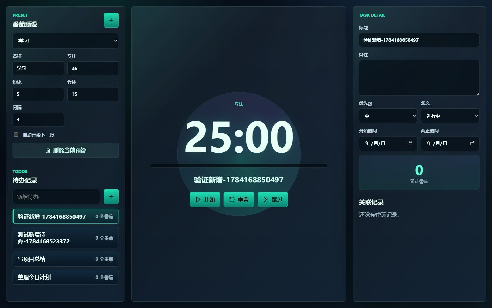

# 番茄时钟与待办

一个本地运行的科技风番茄钟与个人待办应用。它把专注计时、任务计划、开始日期、截止日期和番茄记录放在同一个三栏工作台里，适合学习、写作、编程和日常任务推进。



> 当前版本是本地网页应用：数据保存在浏览器 `localStorage`，不需要账号，不上传云端。

## 功能亮点

- **自定义番茄预设**：内置学习、编程、写作、轻量模式，也可以复制并编辑自己的专注/休息时长。
- **任务绑定计时**：选择待办后开始番茄，成功完成的专注番茄会累计到该任务。
- **临时番茄支持**：不想先建任务时，也可以直接开始专注。
- **待办时间管理**：待办支持开始日期和截止日期，日期只保留年月日。
- **状态流转清晰**：支持未开始、进行中、已完成、已归档。
- **智能时间提示**：今天开始、即将截止、已逾期会自动显示。
- **关联记录过滤**：任务详情只展示成功完成的番茄记录，跳过和重置不会混入成果记录。
- **本地持久化**：刷新页面后预设、待办、日期和番茄记录仍会保留。
- **科技暗色界面**：深色玻璃质感、发光计时器、响应式三栏布局。

## 界面结构

- **左侧面板**：番茄预设、预设参数、待办列表、新增待办。
- **中间面板**：当前阶段、大号计时器、当前任务、开始/暂停/重置/跳过。
- **右侧面板**：任务详情、优先级、状态、开始日期、截止日期、累计番茄和关联记录。

## 技术栈

- React 18
- TypeScript
- Vite
- Vitest
- Testing Library
- Lucide React
- CSS 原生响应式布局
- `localStorage` 本地数据存储

## 快速开始

```powershell
npm install
npm run dev
```

启动后打开终端显示的本地地址，通常是：

```text
http://127.0.0.1:5173/
```

## 常用命令

```powershell
# 启动开发服务器
npm run dev

# 运行测试
npm test

# 构建生产版本
npm run build
```

## 测试覆盖

当前测试覆盖核心领域逻辑和关键交互：

- 默认番茄预设和默认待办
- 未开始状态
- 开始日期/截止日期
- 截止日当天不算逾期
- 本地存储恢复
- 任务绑定番茄累计
- 临时番茄记录
- 新增待办后自动选中
- 任务详情只显示成功完成的番茄记录

## 数据说明

应用使用一个版本化 JSON 对象保存在浏览器 `localStorage` 中：

```ts
type AppData = {
  version: 1;
  presets: TimerPreset[];
  todos: Todo[];
  pomodoroRecords: PomodoroRecord[];
  activePresetId: string;
};
```

如果本地数据损坏，应用会自动恢复默认数据，并显示恢复提示。

## 设计原则

这个项目的第一版目标不是做成复杂管理系统，而是做一个打开就能用的个人专注工作台：

- 少跳转，所有核心动作都在一个界面完成。
- 少打扰，番茄记录只保留真正完成的成果。
- 少负担，日期只保留年月日，避免过度排程。
- 可扩展，后续可以继续加入桌面打包、通知、统计图和导入导出。

## 后续方向

- 桌面端打包：Electron 或 Tauri
- 桌面通知
- 数据导入/导出
- 每日/每周专注统计
- 日历视图
- 快捷键

## License

MIT
